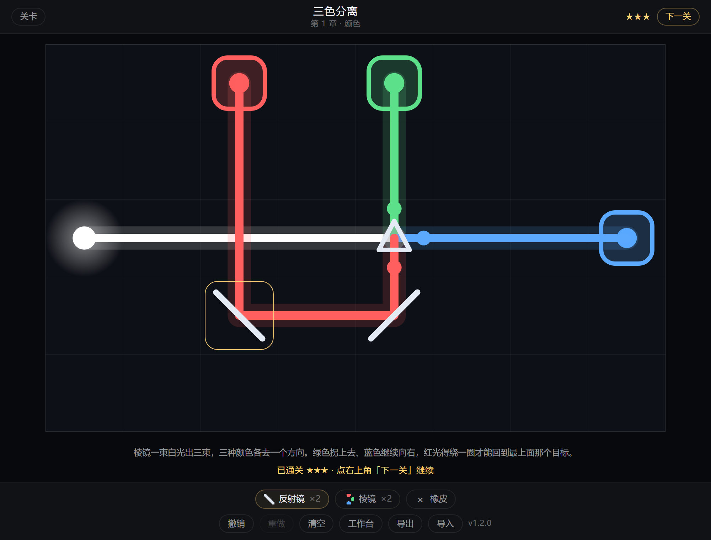

# 光的游戏 · light_game

[](https://github.com/xiaoxuhui/light_game/actions/workflows/test.yml)
[](LICENSE)

一个零运行时依赖、可离线运行的网格光路解谜游戏。

在线试玩：**https://xiaoxuhui.github.io/light_game/**

安卓版：**[下载 APK](https://github.com/xiaoxuhui/light_game/releases/latest)** —— Android 7.0 及以上，2.24 MB，不申请任何权限。



用反射镜、分光镜和棱镜引导光的方向与颜色，把正确颜色的光送到目标上。
无计时、无失败、无音效，摆弄光路本身就是奖励。

## 玩法

- **元件**：反射镜（转向）、分光镜（一分为二，透射 + 反射）、棱镜（把光按颜色拆成三束：
  红左转 90°、绿直行、蓝右转 90°，三态朝向决定哪个颜色走直行）。
- **颜色**：光在传输中保持颜色，在目标处按加色法合成 —— 红光 + 绿光 = 黄光。
  白光射入棱镜会分成红、绿、蓝三束，各走一个方向；把绿光和蓝光送到同一个目标，
  它就凑成了青色。目标是超集判定：白光含三种颜色，打在只要求单色的目标上也算点亮。
- **星级**：通关 1 星；元件数 ≤ `par + 2` 得 2 星；≤ `par` 得 3 星。
  `par` 是穷举验证过的最小元件数（`npm run verify:par`），用更少的元件解出来才能满星。
- **16 个关卡**，分三章：教学 4 关、颜色 6 关、精算 6 关。
  颜色章不发分光镜（反射镜无法分束），所以那一章必须用棱镜。

| 操作 | 鼠标 / 触摸 | 键盘 |
|---|---|---|
| 选中元件 | 点击底栏工具 | `1`–`3` |
| 选中橡皮 | 点击底栏橡皮 | `E` |
| 放置 | 点击空格 | 方向键移动光标 + `Enter` |
| 旋转（棱镜三态） | 点击已放置的元件 | `R` |
| 删除 | 右键，或选中橡皮后点击 | `Delete` / `Backspace` |
| 撤销 / 重做 | 底栏按钮 | `Ctrl+Z` / `Ctrl+Shift+Z`（或 `Ctrl+Y`） |
| 关卡列表 / 取消选中 / 关浮层 | 顶栏「关卡」 | `Esc` |

布局会自动存档，另有「工作台」可以把当前布局存成具名快照。
「导出」把当前关卡存成 JSON 文件，「导入」可以把它再读回来。

## 路线图

| 阶段 | 内容 | 状态 |
|---|---|---|
| 一 | 电脑浏览器 Web 版（纯静态，无打包器） | ✅ 已完成 |
| 二 | 打包安卓 APK（WebView 外壳 + 内置资源 + 云端构建） | ✅ 已完成（v1.1.0） |

阶段二复用了已在 EML 计算台、康威生命游戏上跑通的打包方案。工程结构从第一天起就按 APK
的约束设计（相对路径、不用 ES Module、Pointer Events、导出收敛到单一函数），所以打包没有返工：
全工程只有导出这一个出口需要在安卓端改走原生桥。

## 安卓版

从 [Releases](https://github.com/xiaoxuhui/light_game/releases) 下载 APK 直接安装即可，
首次安装需要在系统里允许「安装未知来源应用」。包内是同一份 Web 代码加一层 WebView 外壳，
离线可玩，界面与网页版完全一致。

与浏览器相比，跨进程有差异的只有两处，都属于预期：

| 项 | 说明 |
|---|---|
| 导出 | WebView 不支持 `Blob` + `<a download>`，安卓端改由原生桥写系统下载目录，提示语为「已保存到…」 |
| 存档 | 页面跑在 `appassets.androidplatform.net` 的 https 域下，`localStorage` 的 origin 与网页版不同，安卓端存档从零开始 |

出包全程在 GitHub Actions 上云端构建，本地不需要安装 Android SDK。相关命令：

```bash
npm run sync:android    # 把 index.html / scripts / styles 同步进 android/app/src/main/assets
npm run check:android   # 只校验一致性、不写入（CI 用这个）
```

细节与取舍见 [`doc/安卓打包实施计划.md`](doc/安卓打包实施计划.md)。

## 本地运行

需要 Node.js 20.19 或更高版本。

```bash
npm ci            # 安装开发依赖（仅 eslint 与 Playwright，运行时零依赖）
npm run serve     # 启动静态服务，默认 http://127.0.0.1:4174
```

端口刻意避开 4173 —— 那个端口被同目录下的 conway-life-game 占用，
两个项目同时启动时 Playwright 会连错站点。需要改端口用 `PORT=5000 npm run serve`。

也可以直接双击 `index.html` 用 `file://` 打开，项目不依赖任何构建产物。

## 质量命令

```bash
npm run check         # JavaScript 语法检查
npm run lint          # ESLint 静态检查
npm test              # 单元测试 110 条（node --test）
npm run test:browser  # Playwright 验收 60 条（桌面 + 移动视口）
```

## 项目结构

```
index.html                     单页入口
styles/main.css                全部样式，主题变量集中在 :root
scripts/light-core.js          方向表、颜色掩码、反射与分光规则、元件规则表
scripts/light-engine.js        光路求解、目标判定、星级计算
scripts/levels.js              16 关数据 + schema 校验 + 外部关卡注册
scripts/renderer.js            把引擎输出画到 canvas（不含任何规则判定）
scripts/storage.js             存档、工作台快照、JSON 导入导出、downloadFile()
scripts/app.js                 编排：输入 → 引擎 → 渲染 → HUD → 存档
scripts/serve-static.js        零依赖本地静态服务（开发工具，非应用代码）
tests/                         单元测试（不需要浏览器）
e2e/                           Playwright 验收（真实浏览器 + 真实输入）
doc/                           需求与测试用例、设计文档、实施计划、安卓打包文档
android/                       安卓外壳工程（WebView + 内置 assets + 程序化图标）
scripts/sync-android-assets.mjs  把 Web 资源同步进 android 的 assets（开发工具）
.github/workflows/test.yml     CI：语法 + lint + 单测 + 浏览器验收
.github/workflows/android-apk.yml  CI：云端构建 APK，打 tag 时挂到 Release
```

脚本按 `<script defer>` 顺序加载，**加载顺序即依赖顺序**，与 `app.js` 共享全局命名空间。
前五个脚本用 UMD 包装：浏览器里挂到 `globalThis.LightXxx`，Node 单测通过 `module.exports`
拿到同一份实现。新增跨文件全局时记得同步 `eslint.config.js` 的 `crossScriptGlobals`。

分层红线：`light-core` / `light-engine` 不碰 DOM 与 canvas；`renderer` 不复制规则判定，
只读引擎给出的结果；`storage` 的变换函数一律返回新对象、不改入参。

## 设计约束

这些约束是为了让阶段二的 APK 打包不返工，请勿违反：

- **零运行时依赖**：不使用 npm 运行时包、不使用打包器、不请求 CDN。
- **相对路径引用资源**：绝对路径 `/xxx` 在安卓 WebView 里会解析到错误域名并 404 白屏。
- **不使用 `type="module"`**：`file://` 下会被 CORS 拦截；脚本按 `defer` 顺序加载。
- **不用 HTML5 拖放传交互**：安卓触摸端不触发 `dragover` / `drop`，需要 Pointer Events。
- **导出走可替换的下载函数**：WebView 不支持 `Blob` + `<a download>`，届时改由 JS 桥接管，
  所以所有导出都收敛到 `storage.downloadFile()` 这一个出口。

## 性能与规模上限

在 Chromium 1280×800 @ dpr 2 上实测（数值与结论见 `doc/需求与测试用例.md` 的 Q12 表）：

| 场景 | 求解 | 单帧绘制 |
|---|---|---|
| 内置关卡（最大 12×7） | < 0.005 ms | 0.02 ms |
| 极限关卡（40×40 / 998 元件 / 4096 光段） | 6.4 ms | 0.8 ms |

最坏情况仍在 60 fps 的单帧预算内。单次求解超过 4096 光段会停止追踪并给出警示，不冻结页面。

## 许可

[MIT](LICENSE) © 2026 xiaoxuhui
